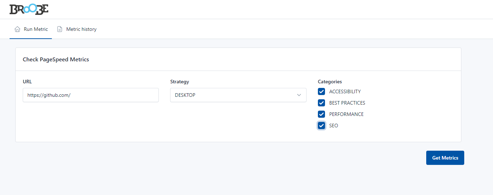
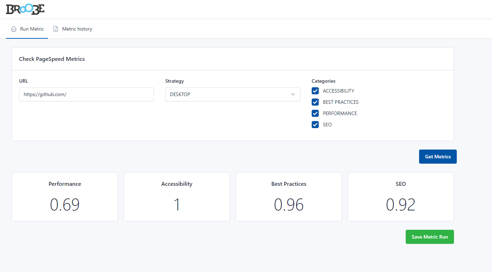
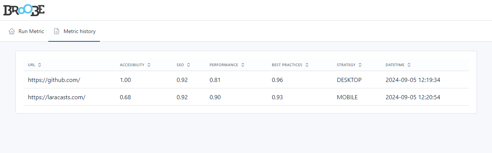

# Laravel PageSpeed Insights: Laravel 10 with PHP 8.1

## Screenshots






## Usage

1. Clone the repository to your local machine: 
```
  git clone https://github.com/ptorterolo/broobe-challenge
```

2. Move into the folder BroobeChallenget: 
```
  cd broobe-challenge
  ```

3. Install project dependencies: 
```
  composer install
  npm install
  ```

4. Uncomment and set right values for your environment (Laravel Sail, Xammp, etc)
  ```
#DB_CONNECTION=mysql
#DB_HOST=mysql
#DB_PORT=3306
#DB_DATABASE=laravel
#DB_USERNAME=sail
#DB_PASSWORD=password

DB_CONNECTION=mysql
DB_HOST=localhost
DB_PORT=3306
DB_DATABASE=laravel
DB_USERNAME=root
DB_PASSWORD=
  ```
[More info about Laravel Sail](https://laravel.com/docs/10.x/sail)

5. Run migrations and seed database: 
```
  php artisan migrate --seed  
```

9. Run the project locally:
  php artisan serve